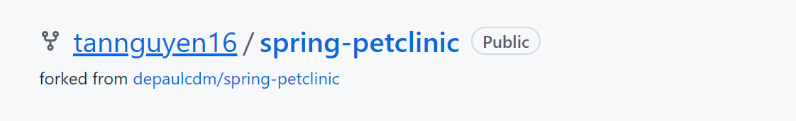
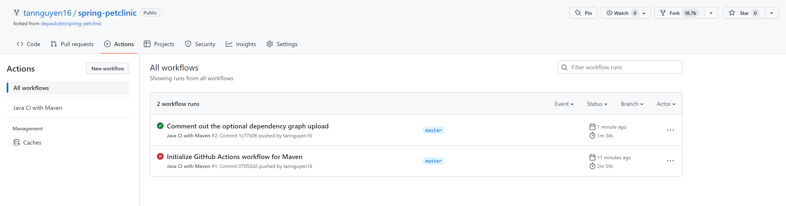
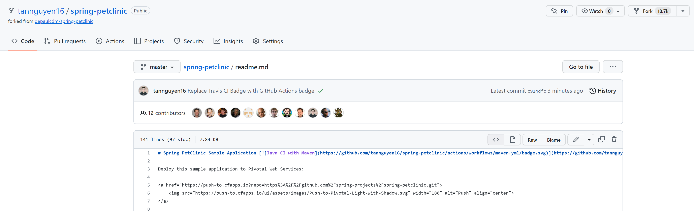
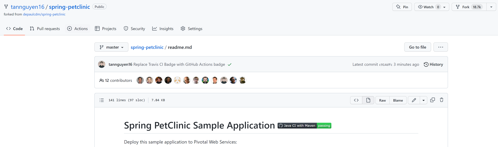
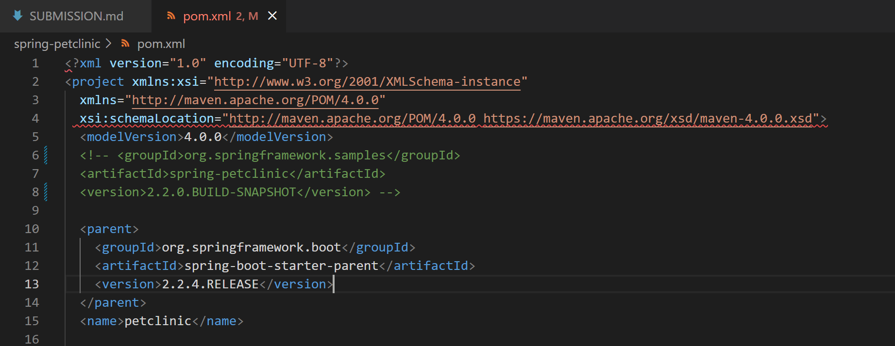
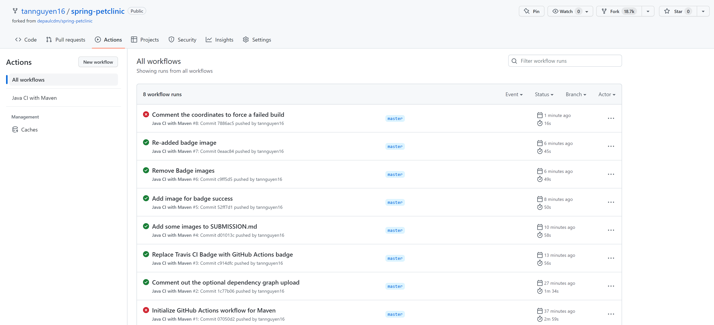
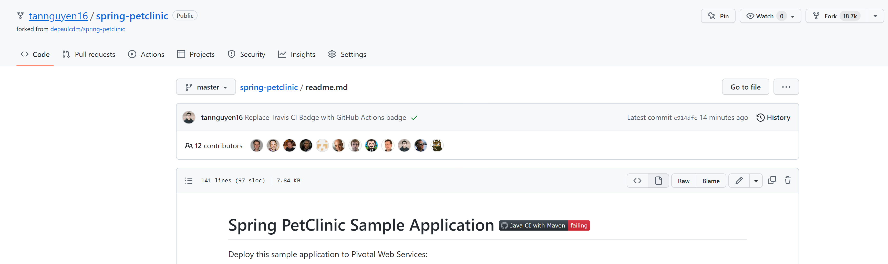
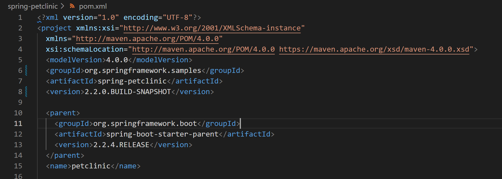
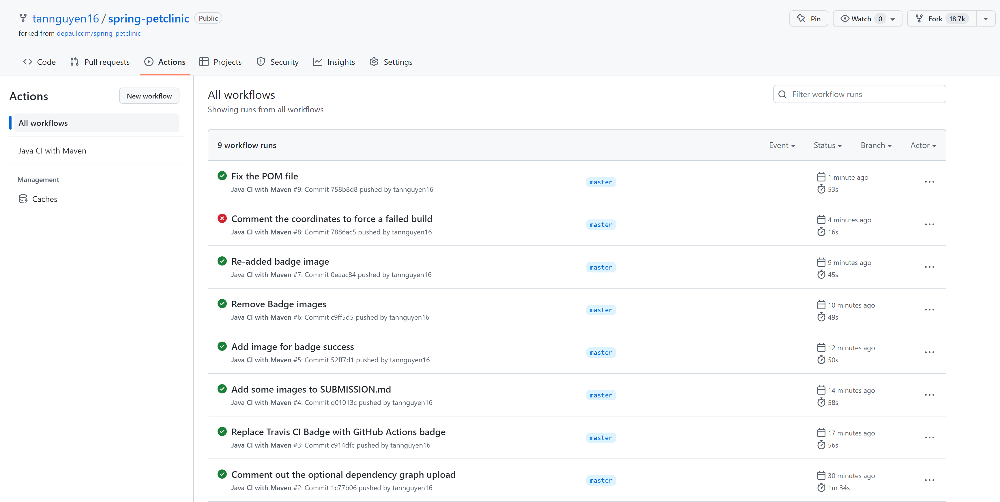

## Tan Nguyen - ID: 2072315
https://github.com/tannguyen16/spring-petclinic

1. 5 pts Your GitHub account showing that is has been forked from the depaulcdm/springpetclinic repository. This doesn’t actually need an image – I can see it
from your repository.

2. 5 pts Your GitHub Actions dashboard showing a successful first build.

3. 5 pts Your GitHub repository with the readme.md file selected showing the code that you changed to update the badge.

4. 5 pts Your GitHub repository with the readme.md file selected showing the build success status after you’ve updated the badge markdown.

5. 5 pts The section of the POM file showing the coordinates after you’ve commented them out.

6. 5 pts Your GitHub Actions dashboard showing the unsuccessful build after the breaking change.

7. 5 pts Your GitHub repository with the readme.md file selected showing the build failed status after the GitHub workflow fails.

8. 5 pts The section of the POM file showing the coordinates after you’ve fixed them.

9. 5 pts Your GitHub Actions dashboard showing the successful build after the breaking change has been fixed.

10. 5 pts Your GitHub repository with the readme.md file selected showing the build success status after the GitHub workflow has recovered.
